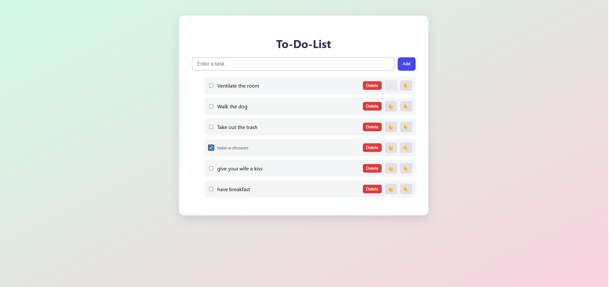

# 📝 React To-Do List Application

A modern, responsive, and minimalistic to-do list application built with React and Vite.  
Features intuitive task management with stylish HSL-based UI design and localStorage support.

---

## 📸 Preview




---

## 🚀 Features

- Add and delete tasks
- Mark tasks as completed
- Reorder tasks (move up/down)
- Persistent task storage (localStorage)
- Clean and responsive interface using HSL color model

---


## 🛠️ Built With

- [React](https://reactjs.org/)
- [Vite](https://vitejs.dev/)
- JavaScript (ES6+)
- HTML & CSS (custom design)

---

## 📦 Installation

To run the project locally:

```bash
git clone https://github.com/dorukmenguverdi/react-todo-list.git
cd react-todo-list
npm install
npm run dev
```
😉 Make sure Node.js is installed on your system.

## 📂 Folder Structure
src/
├── components/       # TaskItem, ToDoList
├── styles/           # App.css (custom styling)
├── App.jsx           # Root component
├── main.jsx          # App entry point
